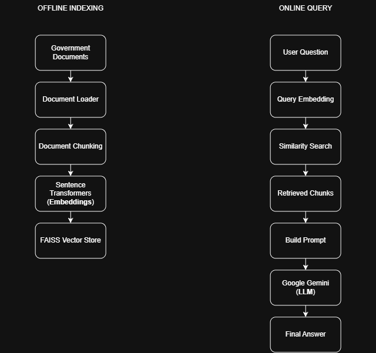
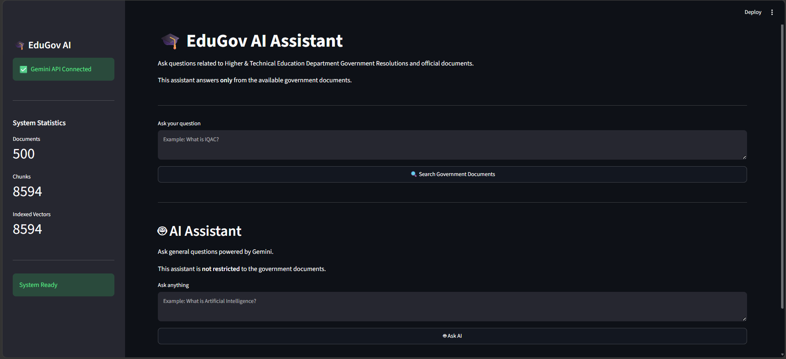
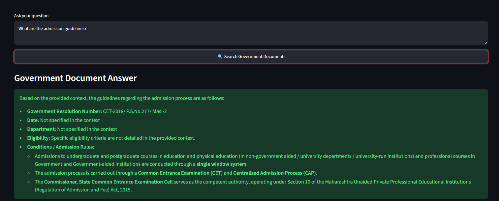
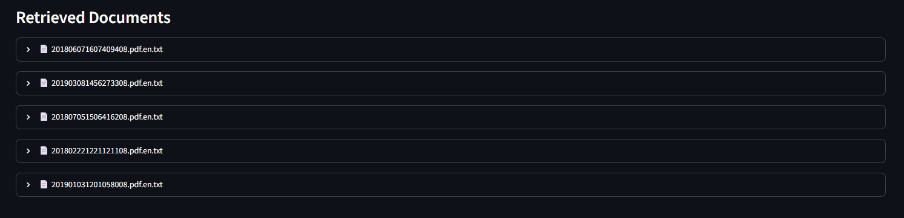
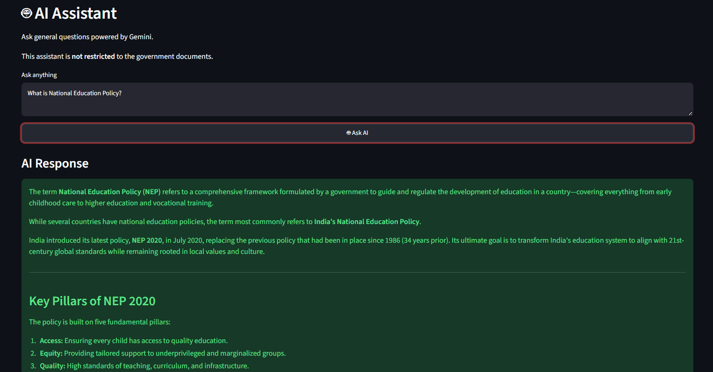

# 🎓 EduGov-AI

An AI-powered Retrieval-Augmented Generation (RAG) application that enables users to query Higher & Technical Education Department documents of the Government of Maharashtra using natural language.

The application combines **Sentence Transformers**, **FAISS**, and **Google Gemini** to retrieve relevant government documents and generate accurate, context-aware responses with source citations.

---

## ✨ Features

- 📄 Search across government education documents using natural language
- 🤖 AI-generated answers powered by Google Gemini
- 🔍 Retrieval-Augmented Generation (RAG) pipeline
- 🧠 Semantic search using Sentence Transformers
- ⚡ Fast document retrieval with FAISS Vector Database
- 📚 Source-aware responses with retrieved document references
- 💾 Persistent FAISS index for faster application startup
- 🌐 Additional General AI Assistant for non-document queries
- 🎨 Interactive web interface built with Streamlit

---

## 🛠️ Tech Stack

| Category | Technologies |
|----------|--------------|
| Programming Language | Python |
| Frontend | Streamlit |
| LLM | Google Gemini Flash |
| Embedding Model | Sentence Transformers (all-MiniLM-L6-v2) |
| Vector Database | FAISS |
| Text Processing | LangChain Text Splitters |
| Environment Management | Python Dotenv |

---

## 🏗️ System Architecture



---

## 📂 Project Structure

```text
EduGov-AI/
│
├── app.py
│
├── utils/
│   ├── cache.py
│   ├── chunker.py
│   ├── config.py
│   ├── document_loader.py
│   ├── embedder.py
│   ├── gemini.py
│   ├── rag.py
│   └── vector_store.py
│
├── data/
├── embeddings/
├── assets/
│
├── .env
├── requirements.txt
└── README.md
```

---

## 🚀 Installation

### Clone the repository

```bash
git clone https://github.com/<your-username>/EduGov-AI.git

cd EduGov-AI
```

### Create a virtual environment

```bash
python -m venv venv
```

### Activate the environment

Windows

```bash
venv\Scripts\activate
```

Linux / macOS

```bash
source venv/bin/activate
```

### Install dependencies

```bash
pip install -r requirements.txt
```

---

## 🔑 Environment Variables

Create a `.env` file in the project root.

```env
GOOGLE_API_KEY=YOUR_GEMINI_API_KEY
```

---

## ▶️ Run the Application

```bash
streamlit run app.py
```

---

## 💡 Example Questions

- What is IQAC?
- Explain Maharashtra Public Libraries Act.
- Explain the examination rules.
- What are the responsibilities of the Principal?
- What are the admission guidelines?

---

## 📸 Application Preview

### Home Page



---

### Government Document Assistant



---

### Retrieved Sources



---

### General AI Assistant



---

## 🔍 How It Works

1. Government documents are loaded from the dataset.
2. Documents are divided into smaller chunks.
3. Each chunk is converted into vector embeddings using Sentence Transformers.
4. Embeddings are indexed using FAISS.
5. User queries are embedded into the same vector space.
6. FAISS retrieves the most relevant document chunks.
7. Retrieved context is combined with the user query.
8. Google Gemini generates an answer based only on the retrieved documents.
9. Relevant document sources are displayed alongside the generated response.

---

## 🚀 Future Enhancements

- Multi-language document support
- PDF upload functionality
- Conversation memory
- Hybrid keyword + semantic search
- Advanced filtering using metadata
- User authentication
- Deployment on Streamlit Cloud or Hugging Face Spaces

---

## 👨‍💻 Author

**Mukund Tiwari**

M.Tech. in Internet of Things

---

## 📄 License

This project is intended for educational and research purposes.